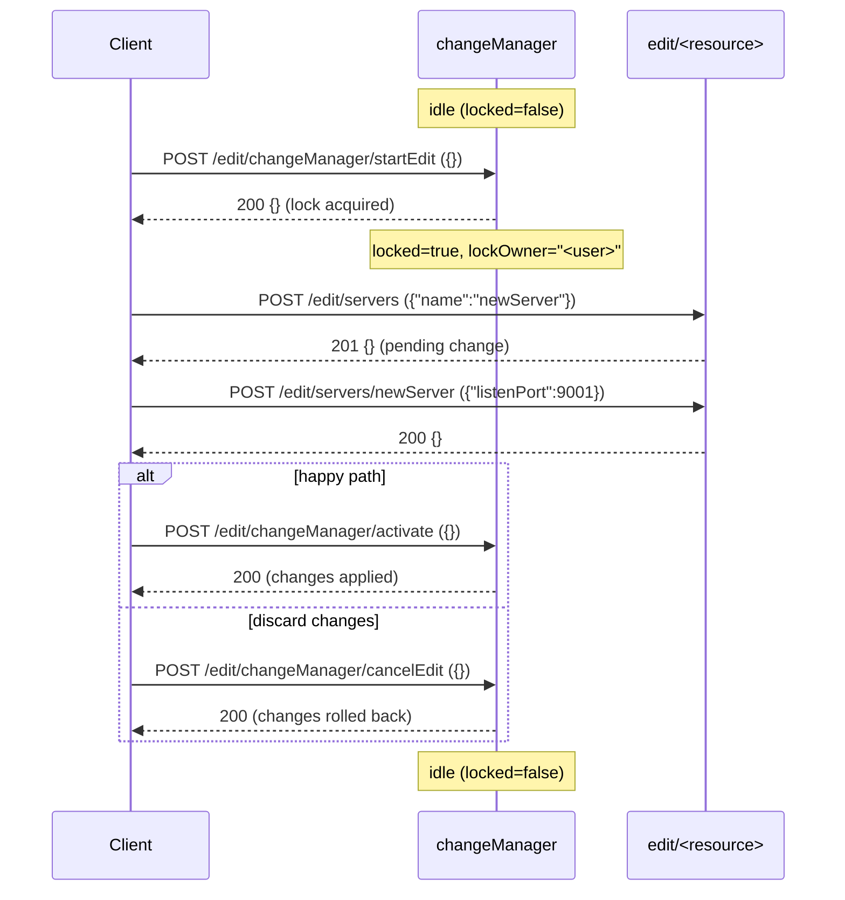

# WebLogic REST Edit Tree — Change Session Workflow

The `/management/weblogic/{version}/edit/...` endpoints mutate domain
configuration. Unlike the read-only `domainRuntime` and `serverRuntime`
trees, every mutation must happen inside an **edit session** held by
the caller. This document describes the session model, the headers
required, and the failure modes observed during v0.3.0 verification on
WebLogic 12.2.1.4 and 14.1.2.

## Lifecycle of a change



## Required headers

Every POST/PUT/DELETE under `/edit/` (and `/edit/changeManager/`) must
include `X-Requested-By: <any value>`. Without it, WebLogic's CSRF
guard rejects the request with `HTTP 400 Bad Request` (plain text, no
diagnostic body). See `CHANGELOG.md` v0.2.0 "Corrections from v0.1.x"
for the broader CSRF audit and the unrelated GET-side surprise on
`/domainRuntime/serverRuntimes`.

GETs under `/edit/` do not require `X-Requested-By`.

## Endpoints

| Method | Path | Purpose |
|---|---|---|
| GET | `/edit/changeManager` | Read current session state. |
| POST | `/edit/changeManager/startEdit` | Acquire the edit lock. Idempotent if you already hold it. |
| POST | `/edit/changeManager/activate` | Apply pending changes and release the lock. |
| POST | `/edit/changeManager/cancelEdit` | Discard pending changes and release the lock. |
| POST | `/edit/changeManager/safeResolve` | Reconcile your changes against a concurrent activation; succeeds only if there is no conflict. |
| POST | `/edit/changeManager/forceResolve` | Force-reconcile, overwriting concurrent changes. |

Bodies are `{}` for the lifecycle ops — none of them carry parameters.

## Session state shape

`GET /edit/changeManager` returns one of two shapes:

**Idle:**
```json
{ "locked": false, "mergeNeeded": false, "editSession": "default" }
```

**Active (lock held):**
```json
{
  "locked": true,
  "lockOwner": "weblogic",
  "hasChanges": false,
  "mergeNeeded": false,
  "editSession": "default"
}
```

`hasChanges` flips to `true` after the first mutating POST/PUT/DELETE
under `/edit/`. `mergeNeeded` is `true` when concurrent activations
have advanced the global config under your edit session — at that
point `safeResolve` (or `forceResolve`) is required before you can
activate.

The `editSession` field hints at named sessions (Multi-Tenant
artifact); the only value observed in the lab is `"default"`.

## Failure modes verified

| Operation | Condition | HTTP | Body |
|---|---|---|---|
| `POST /edit/changeManager/startEdit` (no `X-Requested-By`) | header missing | 400 | plain `Bad Request` |
| `POST /edit/changeManager/startEdit` | already lock owner | 200 | `{}` (idempotent) |
| `POST /edit/changeManager/safeResolve` | no lock held | 400 | `wls:errorsDetails` array, two errors |
| `POST /edit/changeManager/forceResolve` | no lock held | 400 | `wls:errorsDetails` array, two errors |

Notice the **error envelope shape**: edit-tree validation errors return
a richer JSON than the standard `ErrorResponse` used elsewhere in the
API. The relevant key is `wls:errorsDetails` (array of nested
`{type,title,detail}` objects). Clients consuming this surface should
branch on the presence of that key. Cross-version observation:
12.2.1.4 includes the fully-qualified Java exception class name in
the `detail` of each nested error (e.g.
`weblogic.management.provider.EditNotEditorException: Not edit lock owner`),
while 14.1.2 strips the FQCN and keeps only the message. Same
behaviour observed across the validation errors emitted by datasource
creation.

## Operational guidance

- Always pair `startEdit` with either `activate` or `cancelEdit`. A
  dangling session blocks other administrators.
- Deletes are tentative until activate. Recreating a deleted resource
  in the same session is allowed.
- Some bean fields require a server **restart** after activation to
  take effect (most JVM-related server fields, listen address/port).
  This is configuration metadata; the API does not flag it
  per-field.
- Some sub-resources auto-create themselves as part of the parent
  POST response. The most surprising case is `JDBCSystemResources`:
  posting `{"name": "..."}` returns HTTP 400 because the implicit
  child `JDBCResource` lacks a name, **even though the parent shell is
  still created server-side**. Use the staged workflow described in
  `specs/edit/datasources.yaml` instead of expecting a single-shot
  create to work.

## Recovery hints

If you abandon the client mid-session and the lock stays held:

1. Re-acquire it as the same user with `startEdit` (idempotent), then
   `cancelEdit` to clean up.
2. If a different user holds the lock, use `forceResolve` (requires
   admin privileges).
3. As a last resort, the WebLogic Admin Console offers a
   "Release Configuration Lock" action that maps to the same
   underlying operation.
